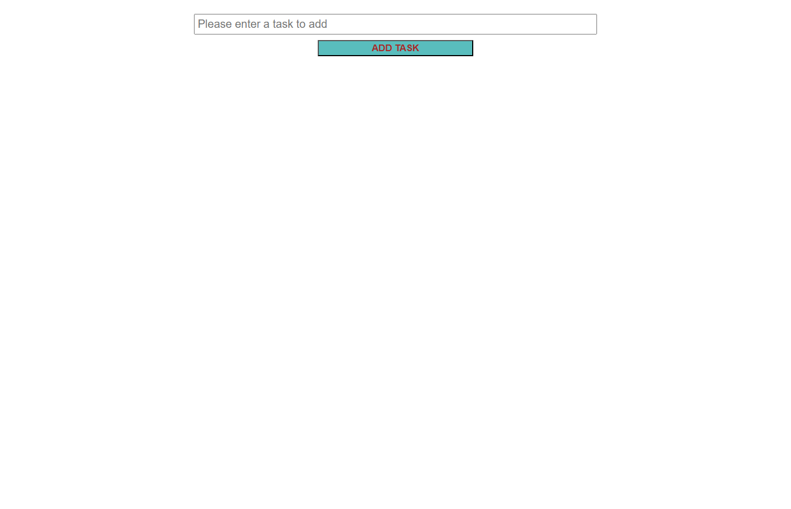
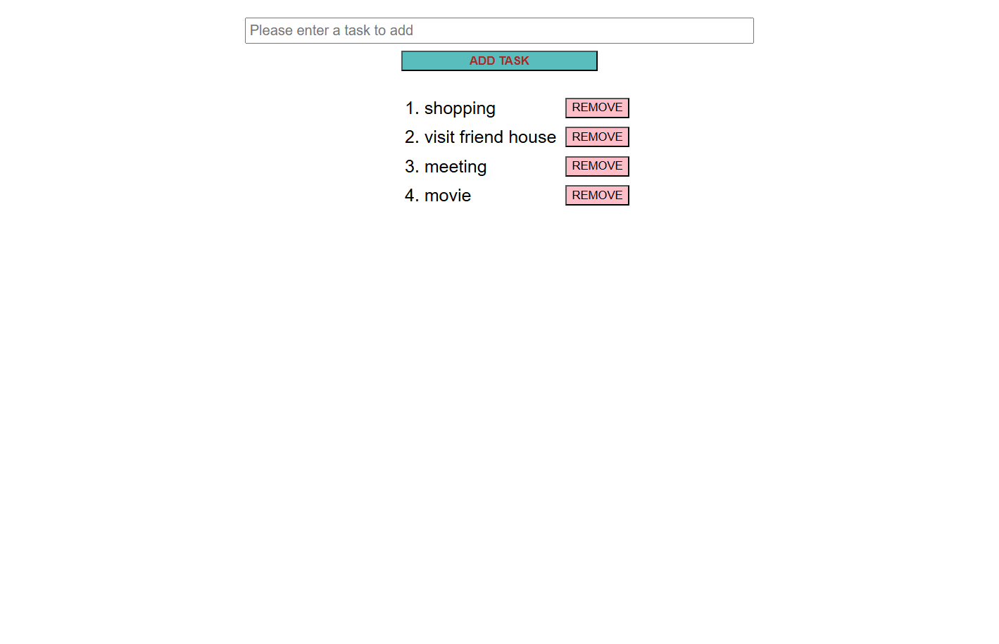
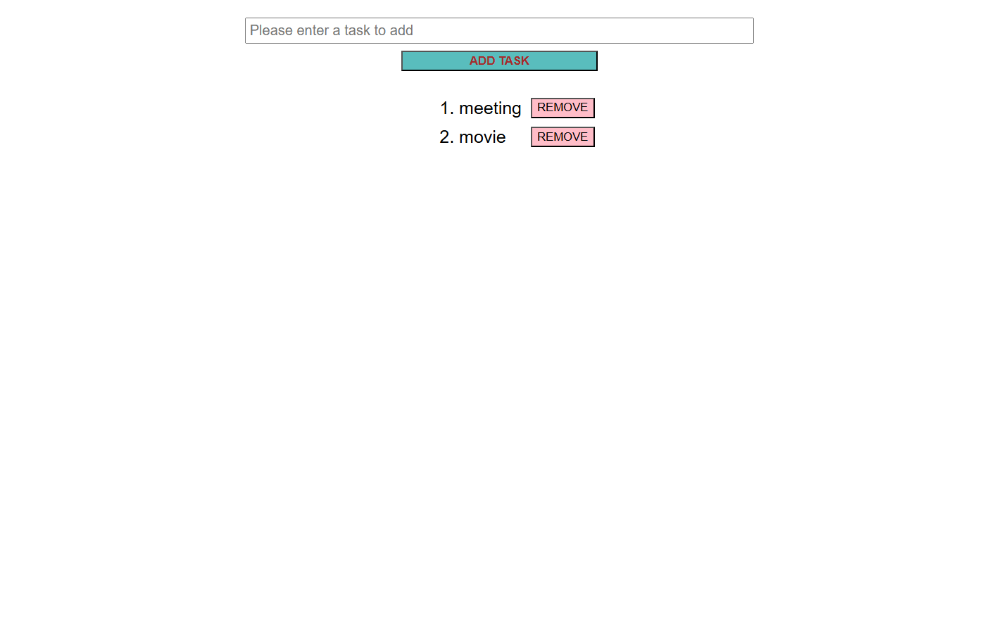

# advancedToDoList
The To-Do List Application is a simple task management tool built using HTML, CSS, and JavaScript. It allows users to create, organize, and remove tasks through an intuitive and responsive user interface.

- [Live Demo](https://advanced-to-do-list-bdddbv1pu-sukhwinder-s-projects.vercel.app)

## Table of Contents
- [Features](#features)
- [Tech Stack](#tech-stack)
- [Screenshots](#screenshots)
- [Deployment](#deployment)

  ## features
 - Add new tasks
- Delete completed or unwanted tasks
- Clean and responsive user interface
- Simple and easy-to-use design

## tech-stack
- HTML
- CSS
- JavaScript

## screenshots
### Home Page
 

### Add Task

### Remove Task

## Deployment
The applicatrion is deployed using vercel
Live: advanced-to-do-list-bdddbv1pu-sukhwinder-s-projects.vercel.app
